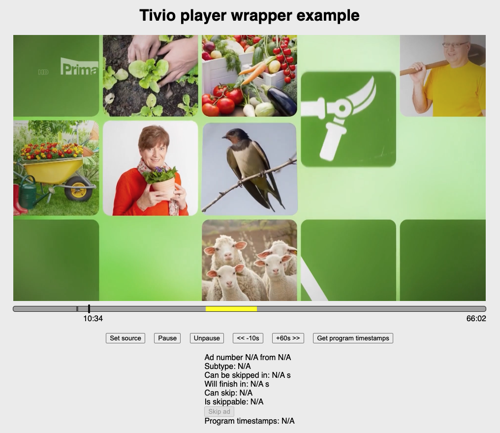

# Tivio ads-js example

The purpose of this example is to show/test basic usage of `@tivio/ads-js`.

## Library and doc

https://www.npmjs.com/package/@tivio/ads-js


## Get started

1. Replace `XXXXXXXXX` with the secret which was provided to you.
2. Then run:

```bash
yarn install
yarn dev
```

## Preview



## Notes

* There is a problem with autoplay in Safari, please use the "Unpause" button to start the playback.
